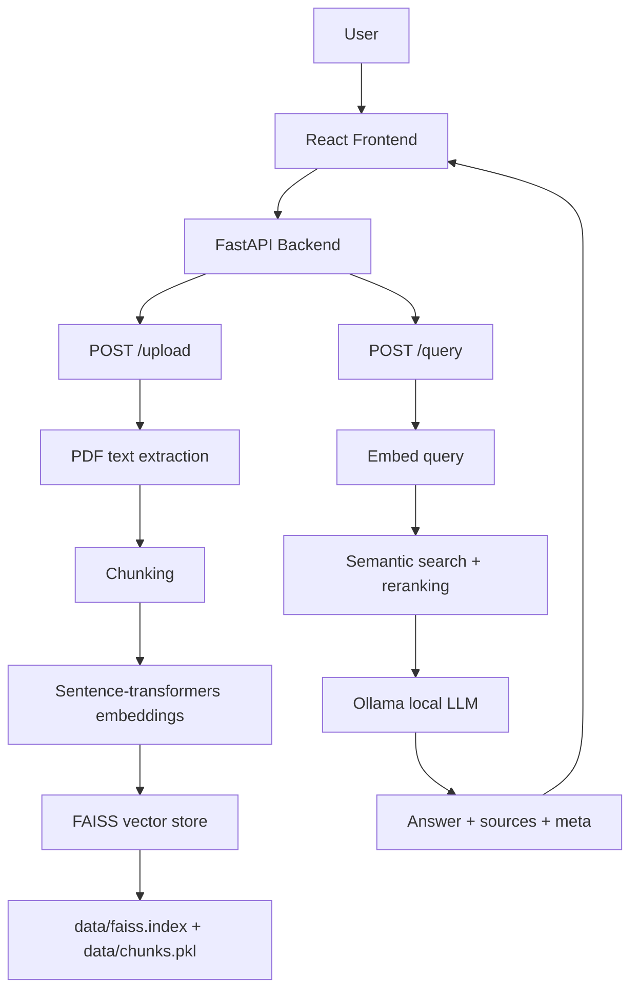
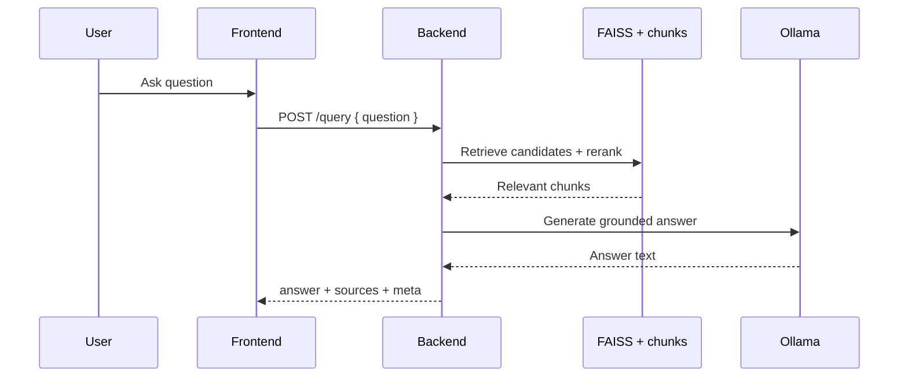

# Simhas

A persistent, source-aware Retrieval Augmented Generation (RAG) chatbot.  
Upload PDF documents and ask questions about them using semantic search and a local LLM.


---

## Table of Contents

- [Overview](#overview)
- [Architecture](#architecture)
- [Project Structure](#project-structure)
- [Features](#features)
- [Prerequisites](#prerequisites)
- [Installation](#installation)
- [Running the App](#running-the-app)
- [API Reference](#api-reference)
- [Configuration](#configuration)
- [How Persistence Works](#how-persistence-works)
- [UX Behavior](#ux-behavior)
- [Evaluation](#evaluation)
- [Error Reference](#error-reference)
- [Tech Stack](#tech-stack)
- [License](#license)

---

## Overview

Simhas is built for source-grounded question answering over uploaded PDFs.

- Ingests text-based PDFs
- Chunks and embeds content for semantic retrieval
- Answers with local LLM inference
- Returns source-aware citations (file and page)
- Persists retrieval state across restarts

---

## Architecture

### System Workflow



### Query Interaction



---

## Project Structure

```text
simhas/
│
├── app/
│   ├── main.py                  # FastAPI app entry point + CORS + startup
│   ├── api/
│   │   ├── routes.py            # HTTP endpoints (/upload, /query)
│   │   └── schemas.py           # Pydantic request/response models
│   ├── core/
│   │   ├── config.py            # All constants (paths, models, chunk params)
│   │   └── startup.py           # Loads persisted data on server boot
│   ├── services/
│   │   ├── pdf_service.py       # PDF text extraction + page-aware chunking
│   │   ├── embedding_service.py # Sentence-transformers wrapper
│   │   ├── retrieval_service.py # Embeds query + searches vector store
│   │   └── llm_service.py       # Ollama local LLM integration
│   ├── db/
│   │   └── vector_store.py      # FAISS index + chunk storage + save/load
│   └── utils/
│       └── chunking.py          # Word-level text chunking with page tracking
│
├── data/                        # Auto-created on first run
│   ├── faiss.index              # Persisted FAISS vector index
│   └── chunks.pkl               # Persisted chunk metadata list
│
├── frontend/
│   ├── index.html               # App entry point (Vite root)
│   ├── package.json
│   ├── vite.config.js
│   └── src/
│       ├── index.js
│       ├── App.jsx
│       ├── api.js               # All fetch calls to backend
│       └── components/
│           ├── Upload.jsx       # PDF upload UI
│           ├── Chat.jsx         # Chat interface
│           └── Message.jsx      # Message bubble + source display
│
├── requirements.txt
├── .gitignore
└── README.md
```

---

## Features

| Feature | Description |
|---|---|
| PDF Upload | Extract and chunk text from any text-based PDF |
| Semantic Search | FAISS vector store with sentence-transformers embeddings |
| Source-Aware Answers | Every answer shows which file and page it came from |
| Retrieval Confidence | Responses include confidence and evidence metadata |
| Persistent Storage | Vector index and chunks survive server restarts |
| Offline LLM | Runs entirely locally via Ollama (no API keys needed) |
| React Frontend | Clean chat UI built with Vite + React, with chat history preserved for the current browser session |

---

## Prerequisites

- Python 3.9+
- Node.js 18+
- [Ollama](https://ollama.ai) installed locally

---

## Installation

### 1) Clone and set up Python environment

```bash
cd simhas
python -m venv venv
source venv/bin/activate        # Windows: venv\Scripts\activate
```

### 2) Install CPU-only dependencies

```bash
# Install CPU-only PyTorch first (prevents GPU packages downloading)
pip install torch --index-url https://download.pytorch.org/whl/cpu

# Install the rest
pip install -r requirements.txt
```

### 3) Set up Ollama

```bash
# Pull the model
ollama pull tinyllama

# Start Ollama (keep running in a separate terminal)
ollama serve
```

### 4) Install frontend dependencies

```bash
cd frontend
npm install
```

---

## Running the App

You need two terminals running simultaneously.

### Terminal 1 - Backend

```bash
cd simhas
source venv/bin/activate
uvicorn app.main:app --reload
```

Backend runs at: `http://127.0.0.1:8000`  
API docs at: `http://127.0.0.1:8000/docs`

### Terminal 2 - Frontend

```bash
cd simhas/frontend
npm start
```

Frontend runs at the Vite dev server URL shown in the terminal.

---

## API Reference

### `POST /upload`

Upload a PDF file.

**Request:** `multipart/form-data` with field `file`

**Response:**

```json
{
  "status": "ok",
  "chunks_stored": 47
}
```

### `POST /query`

Ask a question about uploaded documents.

**Request:**

```json
{ "question": "What are the key findings?" }
```

**Response:**

```json
{
  "answer": "The key findings are...",
  "sources": [
    { "text": "...chunk...", "source": "report.pdf", "page": 3 },
    { "text": "...chunk...", "source": "report.pdf", "page": 5 }
  ],
  "meta": {
    "top_score": 0.82,
    "min_relevance_score": 0.2,
    "used_chunks": 2,
    "retrieved_chunks": 2,
    "candidate_chunks": 12,
    "rerank_applied": true,
    "weak_evidence": false
  }
}
```

### Notes

- `meta.top_score` is the highest retrieval score before thresholding.
- `meta.retrieved_chunks` is the number of chunks that passed the relevance threshold.
- `meta.candidate_chunks` is the number of FAISS candidates considered before reranking.
- `meta.weak_evidence` is true when no chunk passed the relevance threshold.
- Retrieved sources are filtered to avoid showing near-duplicate passages from the same page.

---

## Configuration

All settings are in `app/core/config.py` and can be overridden with environment variables:

| Environment variable | Default | Description |
|---|---|---|
| `SIMHAS_APP_TITLE` | `Simhas RAG Chatbot - Phase 2` | FastAPI app title |
| `SIMHAS_DATA_DIR` | `data/` | Directory for persisted FAISS files |
| `SIMHAS_EMBEDDING_MODEL` | `all-MiniLM-L6-v2` | Sentence-transformers model |
| `SIMHAS_OLLAMA_URL` | `http://localhost:11434/api/generate` | Ollama generate endpoint |
| `SIMHAS_OLLAMA_MODEL` | `tinyllama` | Ollama model name |
| `SIMHAS_TOP_K` | `3` | Number of chunks retrieved per query |
| `SIMHAS_RETRIEVAL_CANDIDATE_K` | `12` | Number of FAISS candidates before reranking |
| `SIMHAS_CHUNK_SIZE` | `150` | Words per chunk |
| `SIMHAS_CHUNK_OVERLAP` | `50` | Overlapping words between chunks |
| `SIMHAS_MIN_RELEVANCE_SCORE` | `0.2` | Minimum chunk relevance to be used in answer generation |
| `SIMHAS_RERANK_LEXICAL_WEIGHT` | `0.2` | Lexical overlap weight in hybrid rerank score (semantic weight is `1 - lexical`) |

Example overrides:

```bash
export SIMHAS_OLLAMA_MODEL="mistral"
export SIMHAS_TOP_K="5"
export SIMHAS_RETRIEVAL_CANDIDATE_K="16"
export SIMHAS_CHUNK_SIZE="200"
export SIMHAS_MIN_RELEVANCE_SCORE="0.45"
export SIMHAS_RERANK_LEXICAL_WEIGHT="0.25"
```

To change the LLM model in Ollama, pull the model first:

```bash
ollama pull mistral
```

---

## How Persistence Works

On every `/upload`:
- `data/faiss.index` - FAISS index written to disk
- `data/chunks.pkl` - Chunk metadata (text, source, page) pickled to disk

On server startup:
- Both files are loaded automatically
- If files don't exist, server starts with an empty store (no errors)

---

## UX Behavior

- Chat history persists across browser reloads within the same browser session and resets when the session ends.

---

## Evaluation

Use the built-in evaluation harness to measure retrieval quality against a small question set:

```bash
python -m app.services.evaluation_service tests/fixtures/eval_cases.json
```

The output includes source-match rate, weak-evidence rate, and average retrieval scores.

---

## Error Reference

| Error | Cause | Fix |
|---|---|---|
| `Only PDF files are accepted` | Wrong file type | Upload a `.pdf` file |
| `No text found in the uploaded PDF` | Scanned/image PDF | Use an OCR tool first |
| `No documents uploaded yet` | Query before upload | Upload a PDF first |
| `Connection refused` (Ollama) | Ollama not running | Run `ollama serve` |
| `nvidia_cublas downloading` | Wrong torch build | Install CPU torch first (see step 2) |

---

## Tech Stack

| Layer | Technology |
|---|---|
| API | FastAPI + Uvicorn |
| PDF Processing | PyMuPDF (fitz) |
| Embeddings | sentence-transformers (`all-MiniLM-L6-v2`) |
| Vector Store | FAISS (CPU) |
| LLM | Ollama (`tinyllama`) |
| Frontend | React 18 + Vite 7 |

---

## License

Copyright (c) 2026 Romin Kevadiya. All rights reserved.

This software and its source code are the exclusive property of Romin Kevadiya.

Permission is granted to view this code for personal reference and educational
purposes only.

You are strictly prohibited from:
- Copying, reproducing, or redistributing this code in whole or in part
- Modifying and publishing this code as your own work
- Using this project or its core logic for any commercial purpose
- Creating derivative works based on this project for distribution
- Re-uploading or duplicating this project on any platform or repository
- Using any part of this codebase in another project without explicit written
  permission from the author

This software is provided "as is", without warranty of any kind, express or
implied. The author shall not be held liable for any damages arising from the
use of this software.

Unauthorized use, reproduction, or distribution of this software may result
in civil and criminal penalties and will be prosecuted to the maximum extent
possible under applicable law.

For licensing inquiries or permissions beyond the scope above, contact:
rominkevadiya@gmail.com
