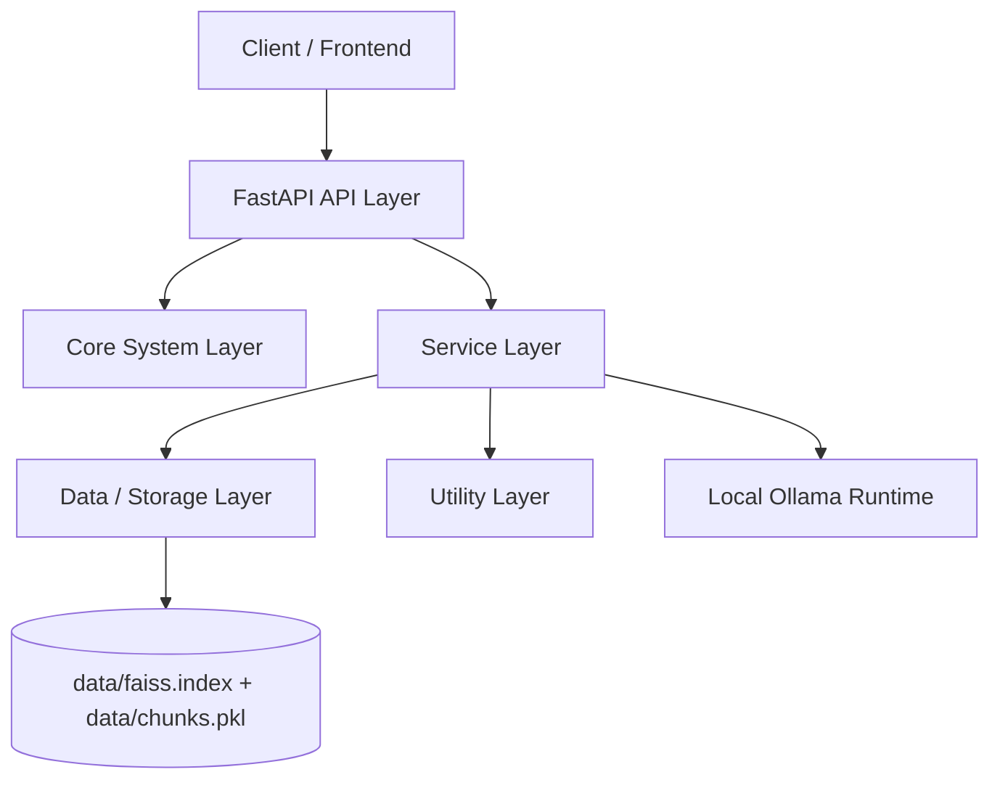
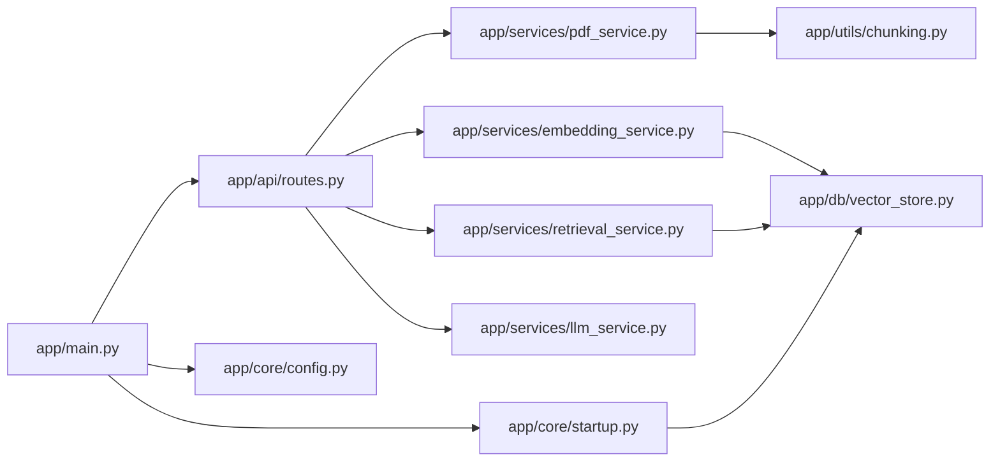
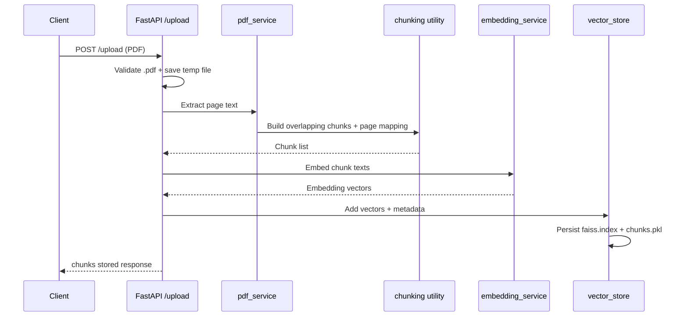
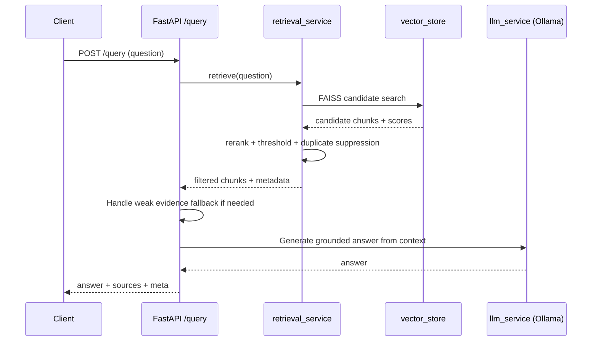
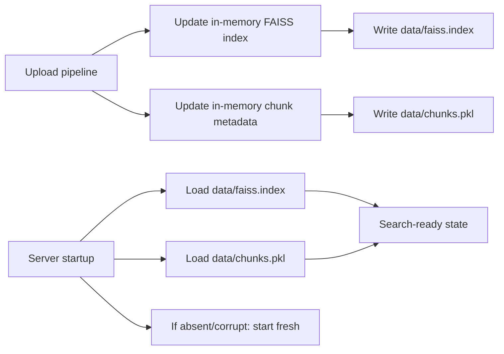
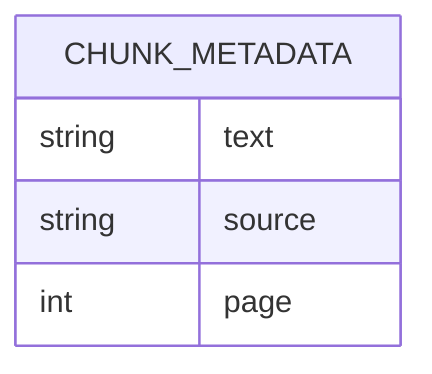

# Backend Architecture Analysis (Simhas)

Professional engineering documentation for technical reviewers and developers.

---

## Table of Contents

- [1. Architecture Classification](#1-architecture-classification)
- [2. System Architecture Overview](#2-system-architecture-overview)
- [3. Backend Layer Breakdown](#3-backend-layer-breakdown)
- [4. Core Technical Concepts](#4-core-technical-concepts)
- [5. API Surface and Request Contracts](#5-api-surface-and-request-contracts)
- [6. End-to-End Workflows](#6-end-to-end-workflows)
- [7. Storage and Persistence Model](#7-storage-and-persistence-model)
- [8. Design Patterns and Engineering Practices](#8-design-patterns-and-engineering-practices)
- [9. Architecture Fit for Project Stage](#9-architecture-fit-for-project-stage)
- [10. Constraints and Trade-Offs](#10-constraints-and-trade-offs)
- [11. Operational Notes](#11-operational-notes)
- [12. One-Line Architecture Summary](#12-one-line-architecture-summary)

---

## 1. Architecture Classification

This backend is built as a **layered modular monolith** with a **pipeline-style RAG workflow**.

- **Modular monolith**: The application runs as one deployable FastAPI service, but code is split into clear modules (`api`, `services`, `db`, `core`, `utils`).
- **Layered architecture**:
  - API layer handles HTTP contracts and orchestration.
  - Service layer contains domain logic (PDF extraction, embeddings, retrieval, LLM generation).
  - Data layer handles vector indexing and persistence.
- **Pipeline design**: Data flows through fixed stages for ingest and query (extract -> chunk -> embed -> index, then embed query -> retrieve -> generate).

So this is not microservices, not hexagonal/clean architecture in a strict sense, and not event-driven. It is a pragmatic, single-process architecture optimized for local execution and rapid development.

---

## 2. System Architecture Overview

---

## 3. Backend Layer Breakdown

### 3.1 Layer Responsibilities

| Layer | Files | Responsibilities |
|---|---|---|
| API Layer | `app/main.py`, `app/api/routes.py`, `app/api/schemas.py` | Expose `/upload` and `/query`; validate request/response structures via Pydantic; coordinate service calls |
| Core/System Layer | `app/core/config.py`, `app/core/startup.py` | Centralized configuration constants (models, paths, chunk params, retrieval params); startup lifecycle (create data dir, load persisted FAISS/chunks) |
| Service Layer | `app/services/*.py` | `pdf_service.py`: extract text and build page mapping; `embedding_service.py`: lazy-load sentence-transformer and produce vectors; `retrieval_service.py`: embed question and fetch top-k chunks; `llm_service.py`: prompt construction and Ollama call |
| Data/Storage Layer | `app/db/vector_store.py` | Maintain FAISS index in memory; persist FAISS index and chunk metadata to disk; similarity search over normalized embeddings |
| Utility Layer | `app/utils/chunking.py` | Overlapping word-based chunking; page attribution per chunk using char offsets |

### 3.2 Module Map

---

## 4. Core Technical Concepts

### 4.1 Retrieval-Augmented Generation (RAG)

The backend follows a classic RAG design:
1. Convert documents into chunks.
2. Embed chunks into vector space.
3. Embed user query.
4. Retrieve nearest chunks.
5. Generate answer from retrieved context only.

This directly improves groundedness and source traceability.

### 4.2 Semantic Search with Embeddings

- Uses `sentence-transformers` model `all-MiniLM-L6-v2`.
- Same embedding model is used for both documents and questions (shared vector space).
- Retrieval is nearest-neighbor similarity search in FAISS.

### 4.3 Vector Database Pattern (Lightweight)

- Uses FAISS `IndexFlatL2` as an in-process vector index.
- Embeddings are L2-normalized before insert/search.
- Metadata (`text`, `source`, `page`) is stored separately in `chunks.pkl`.
- Retrieval now keeps a candidate pool, reranks chunks with a lightweight lexical signal, filters weak matches with a minimum relevance threshold, and suppresses near-duplicate passages from the same source page.

### 4.4 Source-Grounded Answering

- Retrieved chunks are passed into a strict prompt.
- Prompt rules enforce:
  - answer from provided context only,
  - short answer,
  - explicit fallback when context is insufficient.
- API returns answer, source chunks, and retrieval metadata for explainability and confidence display.

### 4.5 Local-First AI Inference

- LLM generation uses Ollama over local HTTP.
- No cloud LLM dependency in core backend path.
- This supports privacy and offline-friendly operation.

### 4.6 Persistence Across Restarts

- On upload: writes `data/faiss.index` and `data/chunks.pkl`.
- On startup: attempts to reload both files.
- If files are absent/corrupt, service starts fresh (graceful fallback).

---

## 5. API Surface and Request Contracts

### 5.1 Routes

| Route | Method | Purpose |
|---|---|---|
| `/upload` | `POST` | Ingest PDF, extract/chunk/embed, index and persist |
| `/query` | `POST` | Retrieve relevant chunks and generate grounded answer |

### 5.2 Middleware and API Framework Context

| Concern | Implementation |
|---|---|
| API framework | FastAPI |
| Schema validation | Pydantic models in `app/api/schemas.py` |
| Startup lifecycle | Data directory creation + persisted FAISS/chunks load |

---

## 6. End-to-End Workflows

## 6.1 Upload Flow (`POST /upload`)

1. Validate uploaded file extension is `.pdf`.
2. Save upload temporarily.
3. Extract text page-by-page (PyMuPDF).
4. Chunk text with overlap and page mapping.
5. Embed chunks.
6. Add embeddings + chunk metadata to vector store.
7. Persist index and metadata to disk.
8. Return chunk count.

## 6.2 Query Flow (`POST /query`)

1. Reject if no indexed data exists.
2. Embed question.
3. Retrieve a larger candidate set from FAISS.
4. Rerank candidates using a hybrid semantic + lexical score.
5. Filter chunks below the minimum relevance threshold.
6. If none pass the threshold, return a safe no-result response with weak-evidence metadata.
7. Build strict prompt from the filtered context.
8. Call Ollama for final answer.
9. Return answer + source chunks + retrieval metadata.

---

## 7. Storage and Persistence Model

### 7.1 Data Interactions

| Artifact | Type | Role |
|---|---|---|
| `data/faiss.index` | FAISS index file | Persisted vector index |
| `data/chunks.pkl` | Pickle metadata file | Persisted chunk metadata list (`text`, `source`, `page`) |

### 7.2 Storage Lifecycle

### 7.3 Metadata Shape (Persisted with Chunks)

---

## 8. Design Patterns and Engineering Practices

- **Separation of concerns**: endpoint logic, retrieval logic, and storage are separated into modules.
- **Facade-like services**: service functions provide clean entry points for complex steps.
- **Singleton-style shared state**: module-level `vector_store` and cached embedding model instances.
- **Lazy initialization**: embedding model is loaded on first use.
- **Configuration centralization**: tunables live in one config file.
- **Schema-first API contracts**: Pydantic models define strong request/response types.
- **Fail-fast input validation**: clear early HTTP errors for invalid upload/query states.

---

## 9. Architecture Fit for Project Stage

This architecture is a strong fit for MVP-to-early-production local RAG use cases:

- Low operational complexity.
- Easy to read and extend.
- Fast enough for modest document volumes.
- Transparent source-grounded behavior.

It intentionally trades distributed scalability for simplicity and local reliability.

---

## 10. Constraints and Trade-Offs

### 10.1 Scalability

- `IndexFlatL2` is exact search and can become costly as data grows.
- Single-process in-memory state limits horizontal scaling.

### 10.2 Concurrency

- File-based persistence and shared in-process state are not designed for high write concurrency.

### 10.3 Retrieval Quality

- Fixed-size word chunking is simple but not semantic; section/heading-aware chunking could improve results.
- Reranking is lightweight and heuristic; it improves precision but is still not a learned reranker.
- Thresholding can suppress weak evidence, which is helpful for trust but can increase fallback responses.

### 10.4 Robustness

- LLM service relies on Ollama availability and model health.
- Error handling around external requests can be expanded for resilience and observability.

### 10.5 Security

- CORS is fully open (`allow_origins=["*"]`), acceptable for dev but risky for hardened deployments.

### 10.6 UX State

- Chat history persists for the current browser session and resets when the session ends.

---

## 11. Operational Notes

- Retrieval metadata now reflects candidate filtering, reranking, thresholding, and duplicate suppression for more useful source previews.
- A lightweight evaluation harness is available in `app/services/evaluation_service.py` with fixture cases under `tests/fixtures/`.

---

## 12. One-Line Architecture Summary

The backend is a **FastAPI-based layered modular monolith implementing a local-first RAG pipeline** with **FAISS vector retrieval**, **sentence-transformer embeddings**, **Ollama generation**, and **disk persistence** for source-aware PDF question answering.
