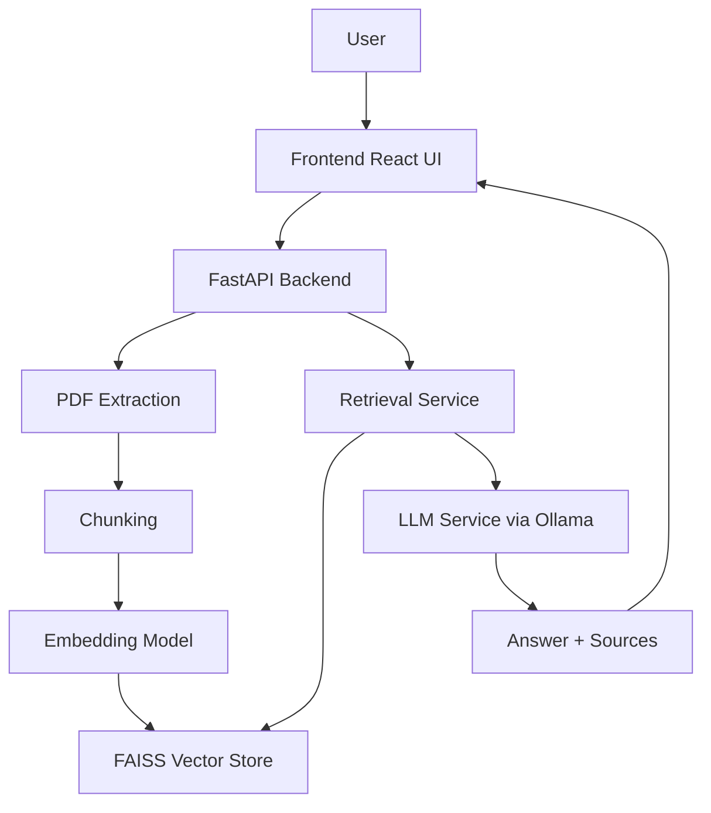
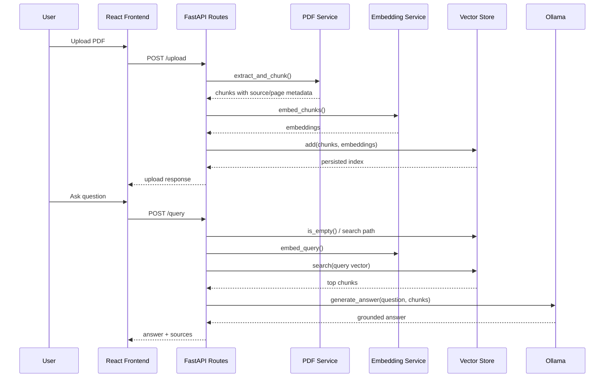
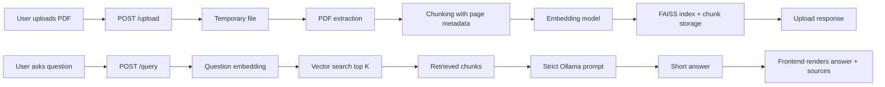

# Simhas Model Overview

## 1. Project Overview

Simhas is a source-grounded Retrieval Augmented Generation system for querying PDF documents. The project lets a user upload a PDF, chunk and embed its contents, retrieve the most relevant excerpts for a question, and generate a concise answer with visible source evidence.

The problem it solves is simple: users often need answers from private documents, but generic chatbots either do not know those documents or answer without showing proof. Simhas is built for trust, not just fluency. It is useful for research, internal knowledge lookup, policy review, legal or compliance work, and study support where the answer must be traceable back to the source.

Why this solution was needed:
- Private documents should stay local instead of being sent to a cloud AI service.
- Answers need citations so users can verify them.
- A lightweight system is easier to run than a full enterprise search stack.
- PDF question answering is more useful when the answer is short, contextual, and evidence-backed.

Real-world use case:
- A user uploads a policy handbook or research report.
- They ask a direct question such as what the document says about reimbursement, deadlines, or findings.
- The system searches the uploaded content, extracts the best matches, and returns a short answer with the file name and page number for each source snippet.

## 2. High-Level Architecture

Simhas has a simple but clear pipeline:

### Main components

| Layer | Main files | Responsibility |
|---|---|---|
| Backend entry point | [app/main.py](app/main.py), [app/core/startup.py](app/core/startup.py) | Create the FastAPI app, configure CORS, load persisted data on startup |
| API layer | [app/api/routes.py](app/api/routes.py), [app/api/schemas.py](app/api/schemas.py) | Define upload and query endpoints and request/response models |
| PDF processing | [app/services/pdf_service.py](app/services/pdf_service.py), [app/utils/chunking.py](app/utils/chunking.py) | Extract text from PDFs and split it into page-aware chunks |
| Embeddings and retrieval | [app/services/embedding_service.py](app/services/embedding_service.py), [app/services/retrieval_service.py](app/services/retrieval_service.py) | Convert text to vectors and retrieve the most relevant chunks |
| Storage | [app/db/vector_store.py](app/db/vector_store.py) | Persist and search the FAISS index plus chunk metadata |
| LLM generation | [app/services/llm_service.py](app/services/llm_service.py) | Send retrieved context to Ollama and produce the final answer |
| Frontend | [frontend/src/App.js](frontend/src/App.js), [frontend/src/components/Upload.js](frontend/src/components/Upload.js), [frontend/src/components/Chat.js](frontend/src/components/Chat.js), [frontend/src/components/Message.js](frontend/src/components/Message.js), [frontend/src/api.js](frontend/src/api.js) | Let users upload PDFs, ask questions, and inspect source-backed answers |

### How the components interact

## 3. Core Concepts & Theory

### Retrieval Augmented Generation

What it is:
RAG combines retrieval and text generation. Instead of asking a language model to answer from memory alone, the system first retrieves relevant documents and then asks the model to answer using that context.

Why it is used here:
The project needs answers grounded in uploaded PDFs, not general world knowledge. RAG reduces hallucination risk and makes the response auditable.

How it works:
1. The PDF is converted into smaller pieces of text.
2. Those pieces are embedded into vectors.
3. A question is embedded into the same vector space.
4. The system finds the nearest chunks.
5. The LLM receives only those chunks as context and answers from them.

Technical depth:
This codebase uses a classic two-stage RAG pattern. The retriever is semantic search over FAISS; the generator is a local Ollama model. The prompt explicitly limits the answer to the supplied context and caps it at three sentences.

### Embeddings

What it is:
Embeddings are numeric vectors that represent meaning. Similar texts end up near each other in vector space.

Why it is used here:
Keyword search is not enough for semantic document lookup. Embeddings let the system match questions like what are the consequences of late submission to a paragraph that uses different wording but the same meaning.

How it works:
- [app/services/embedding_service.py](app/services/embedding_service.py) loads sentence-transformers lazily.
- It uses all-MiniLM-L6-v2, which produces 384-dimensional vectors.
- The same model embeds document chunks and user questions so they can be compared directly.

### Vector Search

What it is:
Vector search finds the nearest document chunks to a query vector.

Why it is used here:
It is fast, simple, and good enough for an MVP search layer over a moderate document corpus.

How it works:
- [app/db/vector_store.py](app/db/vector_store.py) stores the embeddings in a FAISS IndexFlatL2 index.
- Vectors are normalized before search, which makes L2 distance behave like cosine-style similarity in practice.
- The retrieval service requests the top K chunks, where K is configured in [app/core/config.py](app/core/config.py).

### Chunking

What it is:
Chunking splits large text into smaller overlapping pieces.

Why it is used here:
LLMs have context limits, and retrieval works better on smaller semantically coherent units than on entire PDFs.

How it works:
- [app/utils/chunking.py](app/utils/chunking.py) splits text into word-based chunks.
- The code uses overlap so important context is not lost at chunk boundaries.
- Page tracking is preserved using a character offset map, so chunks can be tied back to source pages.

Technical note:
The current implementation relies on text.find() over the extracted PDF text to estimate word positions. That works for straightforward text PDFs, but it can be fragile for complex layouts or repeated words.

### Local LLM inference

What it is:
The final answer is generated by a local model exposed through Ollama.

Why it is used here:
Local inference avoids cloud API keys and keeps document content on the user’s machine or local network.

How it works:
- [app/services/llm_service.py](app/services/llm_service.py) sends an HTTP POST request to Ollama.
- The model name is configured as tinyllama in [app/core/config.py](app/core/config.py).
- The prompt instructs the model to answer only from the retrieved context and to stay short.

## 4. Detailed Code Breakdown

### [app/main.py](app/main.py)

Purpose:
Creates the FastAPI application, configures permissive CORS, registers startup logic, and includes the router.

Key behavior:
- Instantiates FastAPI with the project title.
- Adds CORSMiddleware with allow-all origins, methods, and headers.
- Runs the startup hook once when the server boots.
- Mounts the API router from [app/api/routes.py](app/api/routes.py).

Why it matters:
This is the application entry point. It defines how the backend starts and how the API is exposed to the frontend.

### [app/core/startup.py](app/core/startup.py)

Purpose:
Prepares the data directory and loads persisted vector data into memory.

Key behavior:
- Ensures the data directory exists.
- Calls vector_store.load() so previously uploaded PDFs remain queryable after restart.

Design decision:
The project is stateful across restarts without using a database server. That keeps the MVP simple, but it also couples persistence to local disk files.

### [app/core/config.py](app/core/config.py)

Purpose:
Centralizes all configuration constants.

Key values:
- Data paths for FAISS and chunk metadata.
- Embedding model name.
- Ollama URL and model name.
- Retrieval top K.
- Chunk size and overlap.

Why it matters:
Putting these values in one place makes the system easy to tune and makes the docs easier to read because the operational assumptions are visible in a single file.

### [app/api/schemas.py](app/api/schemas.py)

Purpose:
Defines the request and response models for the API.

Models:
- QueryRequest: contains the user question.
- SourceChunk: represents one retrieved source snippet with text, source file, and page.
- QueryResponse: contains the generated answer and a list of source chunks.
- UploadResponse: returns upload status and the number of chunks stored.

Why it matters:
The API contract is explicit, which makes the backend easier to reason about and the frontend easier to implement.

### [app/api/routes.py](app/api/routes.py)

Purpose:
Implements the two public HTTP endpoints.

Upload flow:
- Validates that the file name ends in .pdf.
- Writes the upload to a temporary file.
- Calls extract_and_chunk() to produce source-aware chunks.
- Embeds the chunk texts.
- Adds chunks and embeddings to the vector store.
- Returns the number of stored chunks.

Query flow:
- Rejects the request if no documents have been uploaded yet.
- Calls retrieve() to find the most relevant chunks.
- If nothing relevant is found, returns a fallback answer with no sources.
- Otherwise generates a grounded answer and returns it with source metadata.

Important decisions:
- The route layer coordinates services but does not own business logic.
- Temporary files are deleted after extraction.
- Error messages are user-facing and intentionally simple.

### [app/services/pdf_service.py](app/services/pdf_service.py)

Purpose:
Extracts text from PDFs and prepares it for chunking.

Key behavior:
- Opens the file with PyMuPDF.
- Concatenates text from each page into one large string.
- Records the starting character offset for each page.
- Passes the merged text and page map to the chunking utility.

Why it matters:
This file is the bridge between binary documents and searchable text. The page map is what makes the final source citations possible.

### [app/utils/chunking.py](app/utils/chunking.py)

Purpose:
Breaks document text into overlapping chunks and keeps source metadata.

Key behavior:
- Splits on words rather than tokens.
- Uses a fixed chunk size and overlap from config.
- Determines the page for each chunk using the character offset of its first word.
- Returns dictionaries with text, source, and page.

Important pattern:
The function is intentionally simple and deterministic. That is good for traceability, but it does mean chunk boundaries are not semantic and may break across paragraph or section boundaries.

### [app/services/embedding_service.py](app/services/embedding_service.py)

Purpose:
Loads the embedding model once and exposes helpers for document chunks and questions.

Key behavior:
- Uses a module-level cache for the SentenceTransformer instance.
- Embeds many chunks at once for upload efficiency.
- Embeds one question at a time for retrieval.

Why it matters:
Lazy loading avoids startup cost until the first embedding request. This keeps boot time fast and avoids loading a large model if the service never receives traffic.

### [app/db/vector_store.py](app/db/vector_store.py)

Purpose:
Stores chunks and embeddings, then provides persistent nearest-neighbor search.

Key behavior:
- Creates an IndexFlatL2 FAISS index when the first embeddings arrive.
- Normalizes embeddings before adding them to the index.
- Stores the chunk metadata in a Python pickle file.
- Saves both the index and chunk metadata after every upload.
- Reloads both files on startup if they exist.

Important design choices:
- This is an in-process, file-based persistence layer rather than a database.
- Search is exact but not optimized for very large corpora.
- The code assumes a single writer model, so concurrent writes would need additional coordination.

### [app/services/retrieval_service.py](app/services/retrieval_service.py)

Purpose:
Turns a question into a vector and uses the store to retrieve the most relevant chunks.

Key behavior:
- Embeds the question with the same model used for documents.
- Passes the query vector to the vector store.
- Uses TOP_K from config to decide how many chunks to fetch.

Why it matters:
This file is the semantic search layer. It is intentionally thin, which is good for separation of concerns.

### [app/services/llm_service.py](app/services/llm_service.py)

Purpose:
Formats the prompt and calls Ollama to generate the final answer.

Key behavior:
- Concatenates the retrieved chunks into a context block.
- Uses a strict prompt that forbids prior knowledge.
- Requests non-streaming output from Ollama.
- Applies a long timeout to tolerate slow local inference.

Important pattern:
The model is not trusted to be free-form. It is constrained by instructions, context, and a short answer limit. This reduces verbosity and helps preserve groundedness.

### [frontend/src/api.js](frontend/src/api.js)

Purpose:
Wraps backend fetch calls in reusable helper functions.

Key behavior:
- uploadPDF(file) sends multipart/form-data to /upload.
- queryRAG(question) sends JSON to /query.
- Both helpers parse JSON and surface backend error details.

Why it matters:
This isolates transport details from the UI components.

### [frontend/src/App.js](frontend/src/App.js)

Purpose:
Defines the page structure and composes the upload and chat components.

Key behavior:
- Renders a simple centered layout.
- Displays title and subtitle.
- Places the upload card above the chat card.

Design note:
The frontend currently uses inline styles instead of a dedicated styling system. That keeps the app small, but it limits visual sophistication and maintainability.

### [frontend/src/components/Upload.js](frontend/src/components/Upload.js)

Purpose:
Lets the user select and upload a PDF.

Key behavior:
- Keeps local state for file, status, error, and loading.
- Disables upload while the request is in flight.
- Shows success or error feedback after completion.

### [frontend/src/components/Chat.js](frontend/src/components/Chat.js)

Purpose:
Implements the interactive Q and A experience.

Key behavior:
- Stores the message history in local component state.
- Sends a question when the user presses Enter or clicks Send.
- Appends the user question immediately before the network call completes.
- Appends the assistant answer when the backend returns.
- Auto-scrolls to the newest message.

Why it matters:
This component is the frontend state machine for the conversation. It controls loading, error handling, and message flow.

### [frontend/src/components/Message.js](frontend/src/components/Message.js)

Purpose:
Renders user and assistant messages.

Key behavior:
- Distinguishes user messages from assistant messages by role.
- Shows source snippets for assistant responses.
- Truncates source text for readability.

Why it matters:
This is where source transparency becomes visible to the user.

## 5. Data Flow

This is the most important operational story in the project.

Step-by-step explanation:
1. The user uploads a PDF through the frontend.
2. The backend validates the file type and stores it briefly on disk.
3. PyMuPDF extracts the page text.
4. The text is chunked into overlapping pieces while preserving page mapping.
5. Each chunk is converted into an embedding vector.
6. The vectors and metadata are written to FAISS plus a pickle file.
7. When the user asks a question, the query is embedded using the same model.
8. FAISS returns the nearest chunks.
9. Those chunks become the context for the Ollama prompt.
10. The LLM returns a short answer.
11. The API returns the answer and the retrieved source snippets.
12. The frontend renders the answer and exposes the evidence trail.

Key implementation detail:
The system does not perform generation first and then search. Search happens first, and generation is constrained by retrieval results.

## 6. Key Functionalities

### PDF upload and indexing

What it does:
Accepts a PDF, extracts text, chunks it, embeds it, and stores it for later retrieval.

How it works internally:
- [app/api/routes.py](app/api/routes.py)
- [app/services/pdf_service.py](app/services/pdf_service.py)
- [app/utils/chunking.py](app/utils/chunking.py)
- [app/services/embedding_service.py](app/services/embedding_service.py)
- [app/db/vector_store.py](app/db/vector_store.py)

### Semantic question answering

What it does:
Accepts a question and returns an answer grounded in the uploaded documents.

How it works internally:
- [app/services/retrieval_service.py](app/services/retrieval_service.py)
- [app/services/llm_service.py](app/services/llm_service.py)
- [app/api/routes.py](app/api/routes.py)

### Source attribution

What it does:
Displays the text snippet, source file, and page number for each supporting chunk.

How it works internally:
- Metadata is attached when chunks are created.
- The retrieval API returns these chunks alongside the answer.
- [frontend/src/components/Message.js](frontend/src/components/Message.js) renders them.

### Persistence across restarts

What it does:
Keeps uploaded knowledge available after the server restarts.

How it works internally:
- [app/db/vector_store.py](app/db/vector_store.py) saves FAISS and chunk metadata to disk.
- [app/core/startup.py](app/core/startup.py) reloads them at startup.

### Minimal chat interface

What it does:
Provides a simple upload-and-ask workflow.

How it works internally:
- [frontend/src/App.js](frontend/src/App.js) composes the page.
- [frontend/src/components/Upload.js](frontend/src/components/Upload.js) handles uploads.
- [frontend/src/components/Chat.js](frontend/src/components/Chat.js) handles questions.

## 7. Algorithms / Models Used

### Sentence Transformers: all-MiniLM-L6-v2

Why this model was chosen:
- It is small enough to run locally and fast enough for an MVP.
- It gives good semantic search quality for short to medium text passages.
- It is widely used and stable for retrieval tasks.

Strengths:
- Lightweight and practical.
- Works well for semantic similarity.
- Easy to swap with another SentenceTransformer model later.

Limitations:
- It is not domain-specialized.
- It does not understand document structure on its own.
- Embedding quality may degrade on very technical or highly specialized documents.

### FAISS IndexFlatL2

Why this approach was chosen:
- Simple to implement.
- No external database is required.
- Good for exact nearest-neighbor search on modest corpora.

Strengths:
- Fast and deterministic.
- Easy persistence to disk.
- Low operational complexity.

Limitations:
- Linear scan behavior does not scale well to very large corpora.
- No built-in filtering, metadata indexing, or hybrid retrieval.
- No approximate search acceleration.

### Ollama with tinyllama

Why this model was chosen:
- Local inference keeps the system private.
- tinyllama is relatively cheap to run compared to larger models.
- Ollama provides a simple HTTP interface.

Strengths:
- No external API dependency.
- Easy to swap models in a local environment.
- Good fit for short answer generation.

Limitations:
- Quality is capped by the small model size.
- Long-context reasoning is limited.
- Response quality depends heavily on the retrieved chunks.

### Overlapping word chunking

Why this approach was chosen:
- It is easy to reason about and implement.
- Overlap reduces the chance of splitting an answer across chunk boundaries.

Strengths:
- Simple and effective.
- Preserves some context between chunks.

Limitations:
- Not semantic.
- Chunk boundaries can cut across headings or table structures.
- Overlap increases the total number of chunks and therefore the storage and retrieval cost.

## 8. Tech Stack Justification

| Technology | Why it was chosen |
|---|---|
| FastAPI | Lightweight, fast, and clean for building typed HTTP APIs |
| Pydantic | Strong request and response validation with minimal boilerplate |
| PyMuPDF | Practical PDF text extraction with good page handling |
| sentence-transformers | Easy access to high-quality embedding models for semantic retrieval |
| FAISS | Efficient local vector search without needing a separate service |
| Ollama | Simple local LLM hosting with an HTTP API |
| React | Familiar component model for a small interactive UI |
| Vite | Fast frontend development and build tooling |
| pickle | Simple persistence for Python object metadata in an MVP setting |

The stack is coherent because every layer supports the same product goal: local, source-aware question answering with minimal infrastructure.

## 9. Strengths of the Project

- Clear separation between ingestion, retrieval, generation, and presentation.
- Strong source grounding: answers are backed by visible snippets and page numbers.
- Local-first design improves privacy and reduces external dependencies.
- Persistent storage makes the app useful across sessions without re-uploading documents.
- Small codebase is easy to understand and extend.
- The API surface is tiny and easy to test or integrate with another frontend.

## 10. Weaknesses / Improvements

Be brutally honest, the current design is an MVP rather than a production system.

Main weaknesses:
- No authentication or authorization.
- CORS is open to all origins.
- Pickle-based metadata persistence is not safe for concurrent writes and is fragile across code changes.
- FAISS IndexFlatL2 does not scale well for very large datasets.
- Retrieval is pure vector search with no keyword fallback or hybrid ranking.
- There is no reranker to improve precision.
- The system does not support conversations with memory or follow-up context.
- The frontend is functional but visually plain and not polished.
- There are no visible automated tests in the repository.
- Error handling is minimal and mostly synchronous.

Useful improvements:
- Replace pickle with a real metadata store such as SQLite or PostgreSQL.
- Add hybrid retrieval, combining vector search with keyword search.
- Add a reranking layer for better answer precision.
- Add OCR for scanned PDFs.
- Add authentication and request limits.
- Add background jobs for large uploads.
- Add observability: logs, metrics, and request tracing.
- Improve the frontend styling and loading states.
- Make chunk parameters and retrieval top K user-configurable.

## 11. Real-World Scalability

How the current system behaves at scale:
- For a small number of PDFs, it will feel responsive and simple.
- As the corpus grows, exact vector search will become slower because IndexFlatL2 searches grow linearly.
- The entire vector store lives in memory, so memory usage will rise as more chunks are added.
- Uploads will get slower because embeddings are computed synchronously during the request.
- Concurrent requests could become problematic because the store is not designed for multi-worker write safety.

What would be required for production:
- Move storage to a proper database or managed object store.
- Separate ingestion from query serving with a job queue.
- Use a stronger FAISS setup or another scalable ANN index.
- Introduce a metadata database for filtering and auditing.
- Add auth, rate limiting, and tenant isolation.
- Add observability and health checks.
- Build a deployment strategy for the LLM service, whether local, containerized, or remote.
- Add caching for repeated queries and embeddings.

Practical scaling note:
The biggest bottlenecks are not just model quality. They are persistence, ingestion latency, and search complexity.

## 12. Glossary

| Term | Simple meaning |
|---|---|
| RAG | A way to answer questions by retrieving relevant documents first and then generating the answer from them |
| Embedding | A numeric representation of text meaning |
| Vector search | Finding the most similar texts using embedding vectors |
| FAISS | A library for fast similarity search over vectors |
| Chunk | A small piece of a larger document |
| Overlap | Repeated words between chunks so context is not lost at boundaries |
| Ollama | A local tool that serves language models over HTTP |
| LLM | A large language model that generates natural language |
| Semantic search | Search based on meaning, not just exact keywords |
| Source grounding | Tying an answer back to a specific piece of evidence |
| Metadata | Extra information about data, such as file name or page number |
| Persistence | Saving data so it survives server restarts |
| CORS | Browser security policy that controls which websites can call an API |
| Pydantic | A Python library for validating and structuring data |
| PyMuPDF | A Python library for reading PDF content |
| OCR | Optical character recognition, used to extract text from scanned images |

## Final Summary

Simhas is a well-scoped RAG application built around a strong product idea: answer questions from private PDFs and show evidence for every answer. The architecture is intentionally simple, and that simplicity is one of its strengths. It is easy to understand, easy to run locally, and easy to extend.

The tradeoff is scalability. The current implementation is excellent for an MVP or small-to-medium document corpus, but it will need stronger storage, retrieval, concurrency, and observability layers before it can behave like a production search system.
